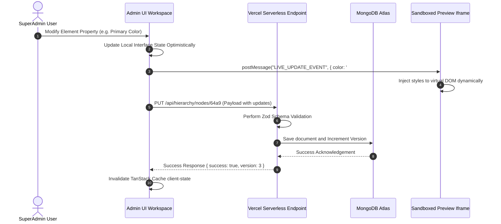
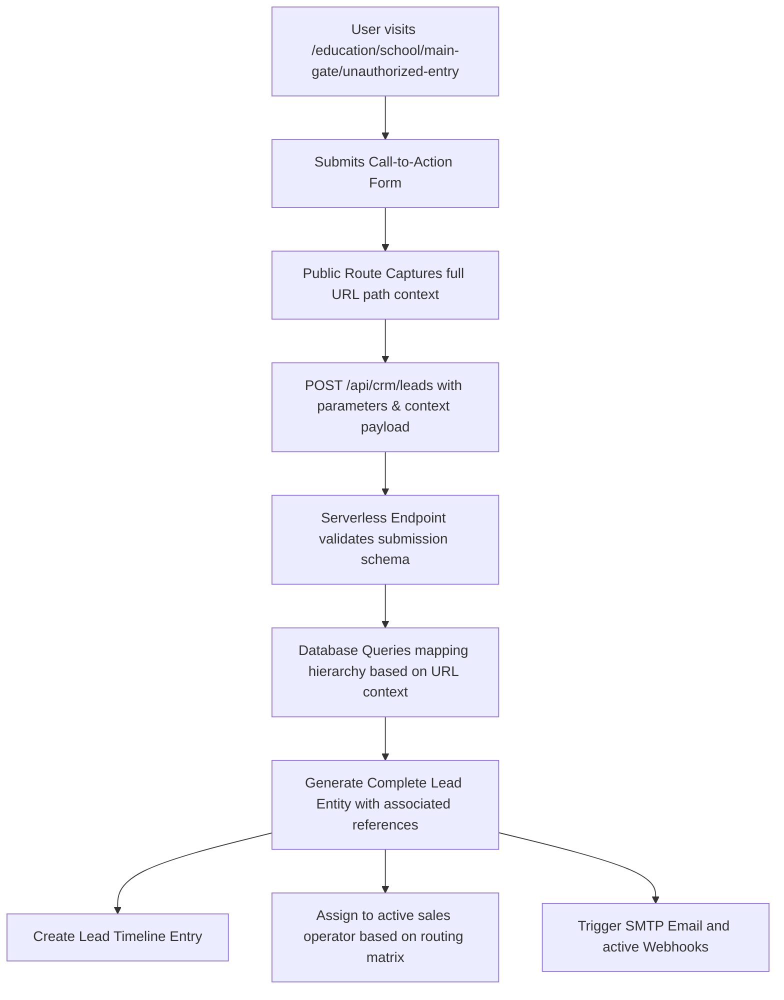
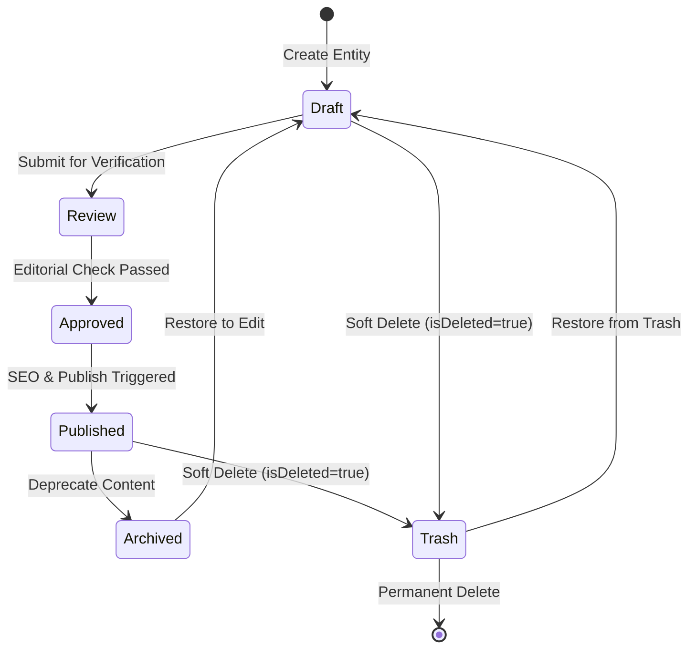

# Engineering Design Document (EDD)
## Project Blueprint: Enterprise Content Management Platform (ECMS)
**Version:** 1.0.0  
**Author:** AI Coding Architect  
**Status:** Approved / Base Architecture Specification

---

## 1. Architectural Overview & Philosophy

This platform is a high-performance, metadata-driven Visual CMS, Dynamic Content Relationship Engine, CRM, and Solution Recommendation System. Unlike traditional CRUD applications or hardcoded static pages, this architecture is fully decoupled, relational, and dynamic.

### System Topography
```
   ┌────────────────────────────────────────────────────────┐
   │                    DATABASE LAYER                      │
   │               MongoDB Atlas (Mongoose)                 │
   └───────────▲────────────────────────────────▲───────────┘
               │                                │
               │ (Serverless API / JSON REST)   │ (Serverless API / JSON REST)
               ▼                                ▼
   ┌───────────────────────┐        ┌───────────────────────┐
   │    PUBLIC WEBSITE     │        │      SUPER ADMIN      │
   │   (Vite + React 19)   │        │   (Visual Flow CMS)   │
   │                       │        │                       │
   │  * Server-State-Driven│        │  * Visual Hierarchy   │
   │  * Reusable Sections  │        │  * Dynamic Form Blg   │
   │  * Auto Dynamic Slugs │        │  * CRM & Analytics    │
   │  * Client-Cache (R-Q) │        │  * Live Edit Preview  │
   └───────────────────────┘        └───────────────────────┘
```

### Core Design Rules
1. **Zero Hardcoding**: All navigation, headers, footers, visual widgets, layout definitions, SEO attributes, colors, and content relationships are managed through database metadata and served via Serverless APIs.
2. **Single Source of Truth**: Dynamic reusable content entities (such as *Problems*, *Solutions*, and *Products*) are created once in their master collection and associated with multiple contexts using relation maps, bypassing duplication.
3. **Optimistic Visual Synchronicity**: Visual changes made in the SuperAdmin are immediately reflected in the live preview using real-time TanStack Query cache invalidation and a post-message iframe layer, without triggering full deployments or page reloads.

---

## 2. MongoDB Database Architecture & ER Diagram

To prevent data duplication while enabling flexible mapping across multiple Industries, Institutions, and Areas, the database uses a **Normalized Junction-Relation Mapping Schema**. 

```mermaid
erDiagram
    users {
        ObjectId _id
        string name
        string email
        string passwordHash
        ObjectId roleId
    }
    roles {
        ObjectId _id
        string name
        array permissions
    }
    industries {
        ObjectId _id
        string slug
        string title
        string status
    }
    institutions {
        ObjectId _id
        string slug
        string title
        string status
    }
    areas {
        ObjectId _id
        string slug
        string name
        string status
    }
    problemCategories {
        ObjectId _id
        string slug
        string title
        string status
    }
    problems {
        ObjectId _id
        string slug
        string title
        string priority
    }
    solutions {
        ObjectId _id
        string slug
        string title
        array sections
    }
    products {
        ObjectId _id
        string sku
        string slug
        string title
    }
    forms {
        ObjectId _id
        string name
        array fields
    }
    media {
        ObjectId _id
        string url
        string publicId
    }

    %% Relationship maps
    industryInstitutionMap {
        ObjectId industryId
        ObjectId institutionId
    }
    institutionAreaMap {
        ObjectId institutionId
        ObjectId areaId
    }
    areaCategoryMap {
        ObjectId areaId
        ObjectId categoryId
    }
    categoryProblemMap {
        ObjectId categoryId
        ObjectId problemId
    }
    problemSolutionMap {
        ObjectId problemId
        ObjectId solutionId
    }
    solutionProductMap {
        ObjectId solutionId
        ObjectId productId
    }

    %% Associations
    users ||--|| roles : "has role"
    industries ||--o{ industryInstitutionMap : "mapped"
    institutions ||--o{ industryInstitutionMap : "mapped"
    institutions ||--o{ institutionAreaMap : "mapped"
    areas ||--o{ institutionAreaMap : "mapped"
    areas ||--o{ areaCategoryMap : "mapped"
    problemCategories ||--o{ areaCategoryMap : "mapped"
    problemCategories ||--o{ categoryProblemMap : "mapped"
    problems ||--o{ categoryProblemMap : "mapped"
    problems ||--o{ problemSolutionMap : "mapped"
    solutions ||--o{ problemSolutionMap : "mapped"
    solutions ||--o{ solutionProductMap : "mapped"
    products ||--o{ solutionProductMap : "mapped"
```



---

## 3. Mongoose Collection Schemas

Every schema contains the mandatory Audit, Security, Versioning, and Soft-delete fields, without exception:
* `status`: `'Draft' | 'Review' | 'Approved' | 'Published' | 'Archived'`
* `visibility`: `'Public' | 'Private' | 'PasswordProtected'`
* `version`: `Number` (Auto-incremented on save for visual restore operations)
* `isDeleted`: `Boolean`
* `deletedAt`: `Date`
* `createdBy` / `updatedBy`: `ObjectId` (references `users`)

### 3.1 SuperAdmin & Authentication Schemas

#### User Schema (`users`)
```typescript
const UserSchema = new Schema({
  name: { type: String, required: true, trim: true },
  email: { type: String, required: true, unique: true, index: true, lowercase: true },
  passwordHash: { type: String, required: true },
  roleId: { type: Schema.Types.ObjectId, ref: 'roles', required: true },
  status: { type: String, enum: ['Active', 'Suspended'], default: 'Active' },
  refreshTokenHash: { type: String, default: null },
  failedLoginAttempts: { type: Number, default: 0 },
  lockoutUntil: { type: Date, default: null },
  lastLoginAt: { type: Date },
  passwordHistory: [{ type: String }], // Hashes of past 5 passwords
  isDeleted: { type: Boolean, default: false },
  deletedAt: { type: Date, default: null },
  createdBy: { type: Schema.Types.ObjectId, ref: 'users' },
  updatedBy: { type: Schema.Types.ObjectId, ref: 'users' }
}, { timestamps: true, versionKey: 'version' });
```

#### Role Schema (`roles`)
```typescript
const RoleSchema = new Schema({
  name: { type: String, required: true, unique: true, uppercase: true },
  description: { type: String },
  permissions: [{
    module: { type: String, required: true }, // e.g. "Industry", "Problem", "Solution", "CRM"
    actions: [{ type: String }] // e.g. "Create", "Read", "Update", "Delete", "Publish", "Archive"
  }],
  isDeleted: { type: Boolean, default: false },
  createdBy: { type: Schema.Types.ObjectId, ref: 'users' },
  updatedBy: { type: Schema.Types.ObjectId, ref: 'users' }
}, { timestamps: true, versionKey: 'version' });
```

### 3.2 Dynamic Flow & Hierarchy Schemas

#### Industry Schema (`industries`)
```typescript
const IndustrySchema = new Schema({
  slug: { type: String, required: true, unique: true, index: true },
  title: { type: String, required: true },
  shortDesc: { type: String, required: true },
  longDesc: { type: String },
  icon: { type: String }, // Icon class or name from vector library
  thumbnail: { type: String }, // URL from Media Library
  banner: { type: String },
  themeColor: {
    primary: { type: String, default: '#0284c7' },
    secondary: { type: String, default: '#0f172a' }
  },
  seo: { type: Schema.Types.Mixed }, // Meta tags, sitemap flags
  status: { type: String, enum: ['Draft', 'Review', 'Approved', 'Published', 'Archived'], default: 'Draft' },
  visibility: { type: String, enum: ['Public', 'Private'], default: 'Public' },
  order: { type: Number, default: 0 },
  isDeleted: { type: Boolean, default: false },
  deletedAt: { type: Date, default: null },
  createdBy: { type: Schema.Types.ObjectId, ref: 'users' },
  updatedBy: { type: Schema.Types.ObjectId, ref: 'users' }
}, { timestamps: true, versionKey: 'version' });
```

#### Institution Schema (`institutions`)
```typescript
const InstitutionSchema = new Schema({
  slug: { type: String, required: true, unique: true, index: true },
  title: { type: String, required: true },
  description: { type: String },
  banner: { type: String },
  image: { type: String },
  icon: { type: String },
  stats: [{
    label: { type: String },
    value: { type: String }
  }],
  seo: { type: Schema.Types.Mixed },
  status: { type: String, enum: ['Draft', 'Review', 'Approved', 'Published', 'Archived'], default: 'Draft' },
  visibility: { type: String, enum: ['Public', 'Private'], default: 'Public' },
  order: { type: Number, default: 0 },
  isDeleted: { type: Boolean, default: false },
  deletedAt: { type: Date, default: null },
  createdBy: { type: Schema.Types.ObjectId, ref: 'users' },
  updatedBy: { type: Schema.Types.ObjectId, ref: 'users' }
}, { timestamps: true, versionKey: 'version' });
```

#### Area Schema (`areas`)
```typescript
const AreaSchema = new Schema({
  slug: { type: String, required: true, unique: true, index: true },
  name: { type: String, required: true },
  description: { type: String },
  image: { type: String },
  icon: { type: String },
  seo: { type: Schema.Types.Mixed },
  status: { type: String, enum: ['Draft', 'Review', 'Approved', 'Published', 'Archived'], default: 'Draft' },
  visibility: { type: String, enum: ['Public', 'Private'], default: 'Public' },
  isDeleted: { type: Boolean, default: false },
  deletedAt: { type: Date, default: null },
  createdBy: { type: Schema.Types.ObjectId, ref: 'users' },
  updatedBy: { type: Schema.Types.ObjectId, ref: 'users' }
}, { timestamps: true, versionKey: 'version' });
```

#### Problem Category Schema (`problemCategories`)
```typescript
const ProblemCategorySchema = new Schema({
  slug: { type: String, required: true, unique: true, index: true },
  title: { type: String, required: true },
  description: { type: String },
  icon: { type: String },
  seo: { type: Schema.Types.Mixed },
  status: { type: String, enum: ['Draft', 'Review', 'Approved', 'Published', 'Archived'], default: 'Draft' },
  visibility: { type: String, enum: ['Public', 'Private'], default: 'Public' },
  isDeleted: { type: Boolean, default: false },
  deletedAt: { type: Date, default: null },
  createdBy: { type: Schema.Types.ObjectId, ref: 'users' },
  updatedBy: { type: Schema.Types.ObjectId, ref: 'users' }
}, { timestamps: true, versionKey: 'version' });
```

#### Problem Schema (`problems`)
```typescript
const ProblemSchema = new Schema({
  slug: { type: String, required: true, unique: true, index: true },
  title: { type: String, required: true },
  shortDesc: { type: String, required: true },
  longDesc: { type: String },
  image: { type: String },
  challenges: [{ type: String }],
  severity: { type: String, enum: ['Low', 'Medium', 'High', 'Critical'], default: 'Medium' },
  priority: { type: Number, default: 0 },
  tags: [{ type: String }],
  seo: { type: Schema.Types.Mixed },
  status: { type: String, enum: ['Draft', 'Review', 'Approved', 'Published', 'Archived'], default: 'Draft' },
  visibility: { type: String, enum: ['Public', 'Private'], default: 'Public' },
  isDeleted: { type: Boolean, default: false },
  deletedAt: { type: Date, default: null },
  createdBy: { type: Schema.Types.ObjectId, ref: 'users' },
  updatedBy: { type: Schema.Types.ObjectId, ref: 'users' }
}, { timestamps: true, versionKey: 'version' });
```

### 3.3 Enterprise Solution Builder & Product Schemas

#### Solution Schema (`solutions`)
```typescript
const SolutionSchema = new Schema({
  slug: { type: String, required: true, unique: true, index: true },
  title: { type: String, required: true },
  shortDesc: { type: String, required: true },
  longDesc: { type: String },
  category: { type: String },
  priority: { type: Number, default: 0 },
  
  // Decoupled Section Configuration Engine
  sections: [{
    type: { type: String, required: true }, // e.g., 'Hero', 'Benefits', 'Workflow', 'ProductMap', 'FAQ'
    isEnabled: { type: Boolean, default: true },
    order: { type: Number, required: true },
    content: { type: Schema.Types.Mixed }, // Structured section specific parameters
    style: { type: Schema.Types.Mixed } // Styles (spacing, background colors, custom layouts)
  }],

  seo: { type: Schema.Types.Mixed },
  status: { type: String, enum: ['Draft', 'Review', 'Approved', 'Published', 'Archived'], default: 'Draft' },
  visibility: { type: String, enum: ['Public', 'Private'], default: 'Public' },
  isDeleted: { type: Boolean, default: false },
  deletedAt: { type: Date, default: null },
  createdBy: { type: Schema.Types.ObjectId, ref: 'users' },
  updatedBy: { type: Schema.Types.ObjectId, ref: 'users' }
}, { timestamps: true, versionKey: 'version' });
```

#### Product Schema (`products`)
```typescript
const ProductSchema = new Schema({
  sku: { type: String, required: true, unique: true, index: true },
  slug: { type: String, required: true, unique: true, index: true },
  title: { type: String, required: true },
  category: { type: String, required: true },
  shortDesc: { type: String },
  description: { type: String },
  thumbnail: { type: String },
  gallery: [{ type: String }],
  specifications: [{
    key: { type: String },
    value: { type: String }
  }],
  downloads: [{
    label: { type: String },
    url: { type: String }
  }],
  seo: { type: Schema.Types.Mixed },
  status: { type: String, enum: ['Draft', 'Published', 'Archived'], default: 'Draft' },
  visibility: { type: String, enum: ['Public', 'Private'], default: 'Public' },
  isDeleted: { type: Boolean, default: false },
  deletedAt: { type: Date, default: null },
  createdBy: { type: Schema.Types.ObjectId, ref: 'users' },
  updatedBy: { type: Schema.Types.ObjectId, ref: 'users' }
}, { timestamps: true, versionKey: 'version' });
```

### 3.4 Junction relation collections (Reference Mapping)

#### Tree Hierarchy Relations (`hierarchy_relations`)
```typescript
const HierarchyRelationSchema = new Schema({
  parentType: { type: String, enum: ['industry', 'institution', 'area', 'category', 'problem'], required: true },
  parentId: { type: Schema.Types.ObjectId, required: true, index: true },
  childType: { type: String, enum: ['institution', 'area', 'category', 'problem', 'solution'], required: true },
  childId: { type: Schema.Types.ObjectId, required: true, index: true },
  order: { type: Number, default: 0 }
}, { timestamps: true });
// Ensure search is exceptionally quick for deep traversals
HierarchyRelationSchema.index({ parentId: 1, childId: 1 }, { unique: true });
```

#### Solution-Product Maps (`solution_products`)
```typescript
const SolutionProductSchema = new Schema({
  solutionId: { type: Schema.Types.ObjectId, ref: 'solutions', required: true, index: true },
  productId: { type: Schema.Types.ObjectId, ref: 'products', required: true, index: true }
}, { timestamps: true });
SolutionProductSchema.index({ solutionId: 1, productId: 1 }, { unique: true });
```

### 3.5 CRM & Forms Schemas

#### Form Schema (`forms`)
```typescript
const FormSchema = new Schema({
  name: { type: String, required: true, unique: true },
  slug: { type: String, required: true, unique: true, index: true },
  fields: [{
    id: { type: String, required: true },
    type: { type: String, required: true }, // 'Text', 'Email', 'Dropdown', 'Checkbox', 'Signature'
    label: { type: String, required: true },
    placeholder: { type: String },
    validation: {
      required: { type: Boolean, default: false },
      regex: { type: String },
      minLength: { type: Number },
      maxLength: { type: Number }
    },
    options: [{ type: String }] // For dropdowns/radios
  }],
  redirectUrl: { type: String },
  webhookUrl: { type: String },
  status: { type: String, enum: ['Active', 'Inactive'], default: 'Active' },
  isDeleted: { type: Boolean, default: false },
  createdBy: { type: Schema.Types.ObjectId, ref: 'users' },
  updatedBy: { type: Schema.Types.ObjectId, ref: 'users' }
}, { timestamps: true, versionKey: 'version' });
```

#### CRM Lead Schema (`crm_leads`)
```typescript
const CRMLeadSchema = new Schema({
  name: { type: String, required: true },
  company: { type: String },
  email: { type: String, required: true, index: true },
  phone: { type: String, required: true },
  country: { type: String },
  state: { type: String },
  city: { type: String },
  
  // Full Dynamic Context Parameters (Auto Captured from User Slugs)
  context: {
    industryId: { type: Schema.Types.ObjectId, ref: 'industries' },
    institutionId: { type: Schema.Types.ObjectId, ref: 'institutions' },
    areaId: { type: Schema.Types.ObjectId, ref: 'areas' },
    problemCategoryId: { type: Schema.Types.ObjectId, ref: 'problemCategories' },
    problemId: { type: Schema.Types.ObjectId, ref: 'problems' },
    solutionId: { type: Schema.Types.ObjectId, ref: 'solutions' },
    interestedProductIds: [{ type: Schema.Types.ObjectId, ref: 'products' }]
  },

  leadSource: { type: String, default: 'Direct Website Submit' },
  utmParams: {
    source: { type: String },
    medium: { type: String },
    campaign: { type: String },
    term: { type: String },
    content: { type: String }
  },

  pipelineStage: { 
    type: String, 
    enum: ['New Lead', 'Qualified', 'Contacted', 'Meeting Scheduled', 'Proposal Sent', 'Negotiation', 'Won', 'Lost'],
    default: 'New Lead',
    index: true
  },
  assignedTo: { type: Schema.Types.ObjectId, ref: 'users', default: null },
  notes: [{
    content: { type: String },
    authorId: { type: Schema.Types.ObjectId, ref: 'users' },
    createdAt: { type: Date, default: Date.now }
  }],
  timeline: [{
    event: { type: String }, // e.g. "Lead Created", "Pipeline Moved to Qualified"
    timestamp: { type: Date, default: Date.now },
    userId: { type: Schema.Types.ObjectId, ref: 'users' }
  }],
  status: { type: String, default: 'Open' }
}, { timestamps: true });
```

### 3.6 Media Schema (`media`)
```typescript
const MediaSchema = new Schema({
  name: { type: String, required: true },
  url: { type: String, required: true },
  publicId: { type: String, required: true, unique: true }, // Cloudinary Id
  format: { type: String },
  sizeBytes: { type: Number },
  folder: { type: String, default: '/' },
  tags: [{ type: String }],
  usageCount: { type: Number, default: 0 },
  usedIn: [{
    entityType: { type: String }, // 'solutions', 'industries', etc.
    entityId: { type: Schema.Types.ObjectId }
  }],
  isDeleted: { type: Boolean, default: false },
  createdBy: { type: Schema.Types.ObjectId, ref: 'users' }
}, { timestamps: true });
```

---

## 4. REST API Contracts

All Serverless Endpoints return standardized JSend envelopes:
* **Success Response:** `200/201 OK` -> `{ "success": true, "message": "...", "data": { ... } }`
* **Error Response:** `400/401/403/404/500` -> `{ "success": false, "message": "Reason...", "error": { ... } }`

### 4.1 Authentication Modules (`/api/auth`)

#### POST `/api/auth/login`
Authenticates administration users, sets high-security, HttpOnly Refresh Token Cookie, and returns a short-lived access JWT.
* **Request:**
  ```json
  {
    "email": "admin@nxsolution.com",
    "password": "SecurePassword123!",
    "rememberMe": true
  }
  ```
* **Success Response (200 OK):**
  ```json
  {
    "success": true,
    "message": "Authentication successful",
    "data": {
      "accessToken": "eyJhbGciOiJIUzI1NiIsInR5cCI6IkpXVCJ9...",
      "expiresIn": 900,
      "user": {
        "id": "64fe8b417c802e053f3e6912",
        "name": "Super Admin",
        "email": "admin@nxsolution.com",
        "role": "SUPERADMIN"
      }
    }
  }
  ```

#### POST `/api/auth/refresh`
Uses the secure `refreshToken` cookie to issue a new Access Token.
* **Cookie Header:** `refreshToken=xyzHash...; HttpOnly; Secure; SameSite=Strict`
* **Success Response (200 OK):**
  ```json
  {
    "success": true,
    "data": {
      "accessToken": "newEyJhbGciOiJIUzI1NiIsIn..."
    }
  }
  ```

---

### 4.2 Dynamic Visual Hierarchy Builder (`/api/hierarchy`)

#### GET `/api/hierarchy/tree`
Fetches the complete structural hierarchy tree with lightweight objects for the SuperAdmin Visual left panel explorer.
* **Success Response (200 OK):**
  ```json
  {
    "success": true,
    "data": {
      "tree": [
        {
          "id": "ind_64a9",
          "type": "industry",
          "label": "Education",
          "slug": "education",
          "children": [
            {
              "id": "inst_77b3",
              "type": "institution",
              "label": "School",
              "slug": "school",
              "children": [
                {
                  "id": "area_99f2",
                  "type": "area",
                  "label": "Main Gate",
                  "slug": "main-gate",
                  "children": []
                }
              ]
            }
          ]
        }
      ]
    }
  }
  ```

#### POST `/api/hierarchy/relation`
Creates or updates many-to-many nodes structural links during left-panel drag & drop.
* **Request:**
  ```json
  {
    "parentType": "institution",
    "parentId": "64b0f9687c802e053f3e6a45",
    "childType": "area",
    "childId": "64b0f9897c802e053f3e6b12",
    "order": 2
  }
  ```
* **Success Response (201 Created):**
  ```json
  {
    "success": true,
    "message": "Relation linked successfully"
  }
  ```

---

### 4.3 Content Solution Builder (`/api/solutions`)

#### POST `/api/solutions`
Creates a decoupled reusable business solution.
* **Request:**
  ```json
  {
    "title": "AI Face Recognition Access Control",
    "slug": "ai-face-recognition",
    "shortDesc": "Enterprise facial authentication to prevent tailgating",
    "sections": [
      {
        "type": "Hero",
        "order": 1,
        "isEnabled": true,
        "content": {
          "title": "Smart High Speed Access Control",
          "bgImage": "https://cloudinary.com/..."
        }
      }
    ]
  }
  ```

---

### 4.4 Dynamic CRM submission (`/api/crm/leads`)

#### POST `/api/crm/leads`
Captures public lead submissions with dynamic routing path state capture.
* **Request:**
  ```json
  {
    "name": "Pratham Sharma",
    "company": "EduGroup Solutions",
    "email": "pratham@edugroup.org",
    "phone": "+919876543210",
    "formSlug": "book-demo",
    "urlContext": "/education/school/main-gate/security/unauthorized-entry/ai-visitor-management",
    "utm": {
      "source": "google",
      "medium": "cpc",
      "campaign": "brand_security"
    }
  }
  ```

---

## 5. Folder Architecture & Dynamic Slug Route Resolving

To completely remove hardcoded page configurations, the dynamic routing parses nested URL path parameters inside a fallback React Route (`*`), querying the database hierarchy relationship recursively to compose pages dynamically.

```
src/
├── Config/                     # Global constants, Axios configurations
├── Shared/                     # Multi-App Utilities, Types, Validations
│   ├── types.ts                # Unified Type interfaces (TypeScript)
│   └── schemas/                # Shared Zod / Data schemas
├── Public/                     # PUBLIC FRONTEND APPLICATION
│   ├── Context/                # Global Settings & Theme context
│   ├── Pages/
│   │   └── CatchAllPage.tsx    # Resolves recursively: /:ind/:inst?/:area?/:cat?/:prob?/:sol?
│   ├── Components/
│   │   ├── SectionRenderer.tsx # Dynamic layout mapper based on component metadata
│   │   └── Reusable/           # Shared stateless elements (Hero, Cards, Grid)
│   ├── Services/               # Public API client proxies (TanStack query)
│   └── Routes/                 # Router declarations
└── SuperAdmin/                 # ADMINISTRATIVE PANEL
    ├── Login/                  # Secure Login Flow
    ├── CRM/                    # Lead and pipeline pipeline interface
    ├── Admin/
    │   ├── IndustryBuilder.tsx # Dynamic Flow Visual Tree Builder
    │   └── SolutionBuilder.tsx # Section configuration workspace
    ├── Layout/                 # Admin workspace layout (Left/Center/Right panels)
    └── Services/               # Admin endpoints and mutation queries
```

### Dynamic Routing slug-resolving logic (`src/Public/Pages/CatchAllPage.tsx`)
```typescript
/**
 * CatchAllPage recursively maps URL parameters:
 * /:industry/:institution?/:area?/:category?/:problem?/:solution?
 * to database relation nodes and serves dynamic section compositions.
 */
import { useParams } from 'react-router-dom';
import { useQuery } from '@tanstack/react-query';
import SectionRenderer from '../Components/SectionRenderer';

export default function CatchAllPage() {
  const { '*' : fullPath } = useParams();
  
  // 1. Resolve Slugs from Path
  const slugs = fullPath?.split('/').filter(Boolean) || [];
  
  // 2. Fetch full layout structure dynamically through the resolve route
  const { data, isLoading, error } = useQuery({
    queryKey: ['route-resolution', slugs],
    queryFn: async () => {
      const response = await fetch(`/api/hierarchy/resolve?slugs=${slugs.join(',')}`);
      if (!response.ok) throw new Error('Failed to resolve path mapping');
      const json = await response.json();
      return json.data; // Returns page layout structures, SEO metadata, Theme overrides, and Section list
    },
    staleTime: 1000 * 60 * 5, // Cache for 5 mins
  });

  if (isLoading) return <LoadingSpinner />;
  if (error || !data) return <NotFoundPage />;

  // 3. Render page composition dynamically
  return (
    <div style={{ '--theme-primary': data.theme?.primary || '#0284c7' } as React.CSSProperties}>
      {data.seo && <DynamicSEOHeads metadata={data.seo} />}
      <DynamicBreadcrumbs currentPath={slugs} />
      {data.sections.map((section: any) => (
        <SectionRenderer 
          key={section.id} 
          type={section.type} 
          content={section.content} 
          style={section.style} 
        />
      ))}
    </div>
  );
}
```

---

## 6. Dynamic Permission Matrix (RBAC)

Every administrative user possesses a specific Role mapping to resource-level permissions:

| Module Resource | CREATE | READ | UPDATE | DELETE | PUBLISH | ARCHIVE |
| :--- | :---: | :---: | :---: | :---: | :---: | :---: |
| **Industry Flow Builder** | SuperAdmin, ContentMgr | All Admin Roles | SuperAdmin, ContentMgr | SuperAdmin | SuperAdmin, Publisher | SuperAdmin, ContentMgr |
| **Solutions Builder** | SuperAdmin, Editor | All Admin Roles | SuperAdmin, Editor | SuperAdmin | SuperAdmin, Publisher | SuperAdmin, Editor |
| **Product Management** | SuperAdmin, ProductsMgr | All Admin Roles | SuperAdmin, ProductsMgr | SuperAdmin | SuperAdmin | SuperAdmin |
| **CRM Leads Pipeline** | SuperAdmin, Sales | SuperAdmin, Sales | SuperAdmin, Sales | SuperAdmin | N/A | N/A |
| **System Settings** | SuperAdmin | SuperAdmin | SuperAdmin | SuperAdmin | SuperAdmin | SuperAdmin |

---

## 7. Visual Interface Layout (SuperAdmin)

### 7.1 Dynamic Hierarchy & Flow Builder Canvas
The CMS editor utilizes a split layout. The Left Panel handles structural organization, the Center Panel displays a sandboxed Iframe Preview of the active route, and the Right Panel serves as the property/style config container.

```
------------------------------------------------------------------------------------------------------
[ TOPBAR: App Status | Notification Logs | Search | Workspace Profile ]
------------------------------------------------------------------------------------------------------
[ LEFT: Tree Explorer ]          [ CENTER: Dynamic Sandboxed Live Preview Canvas ]    [ RIGHT: Properties ]
+----------------------------+  +-----------------------------------------------+  +---------------------+
| (Search Tree...)           |  |                                               |  | Node: "Main Gate"   |
|                            |  | [BREADCRUMB: Home > Education > School ]       |  |                     |
| > 📁 Education             |  |                                               |  | [ Tab: General ]    |
|   v 📂 School              |  | +-------------------------------------------+ |  | Title: Main Gate    |
|     v 📂 Main Gate         |  | | HERO SECTION: Dynamic Headline            | |  | Icon: "Gate"        |
|       📄 Sec Problems      |  | +-------------------------------------------+ |  |                     |
|       📄 Gate Products     |  | | BENEFITS GRID: (MAPPED IN REAL-TIME)       | |  | [ Tab: Theme ]      |
|   > 📁 Healthcare          |  | |   - 99.8% Speed Verification              | |  | Primary: [#0284c7 ] |
|   > 📁 Manufacturing       |  | |   - Zero Intrusion Spill                  | |  |                     |
|                            |  | +-------------------------------------------+ |  | [ Tab: SEO ]        |
| [Add Node] [Duplicate]     |  | | DYNAMIC MAPPED PRODUCTS                   | |  | Meta Title: "..."   |
+----------------------------+  +-----------------------------------------------+  +---------------------+
```

---

## 8. Runtime Flow & Lifecycle Diagrams

### 8.1 Instant Cache-Invalidation Data Sync Flow
When the administrator makes changes, the visual CMS triggers an optimistic update, requests the Serverless API, updates MongoDB, and uses React-Query cache invalidation over postMessage to update the live preview instantly.



### 8.2 Lead Capture and Context Automation Engine


### 8.3 State Transition Logic


---

## 9. Performance, Caching & Curation Policies

### 9.1 Database Query Optimizations & Caching
1. **Compound Indexes**:
   - `HierarchyRelation`: `{ parentId: 1, childId: 1 }` (Ensures $O(1)$ relationship lookups during hierarchical tree walk-through).
   - `CRMLead`: `{ pipelineStage: 1, createdAt: -1 }` (Speed up analytics metrics).
2. **Serverless Edge Caching**:
   - Serve dynamic public layout config route (`/api/hierarchy/resolve`) using Edge middleware caching with `stale-while-revalidate` HTTP directives (`Cache-Control: public, s-maxage=300, stale-while-revalidate=60`).
3. **Optimistic UI Updates**:
   - When drag-and-dropping nodes or updating attributes in SuperAdmin, mutate the UI first and run the backend query asynchronously. On error, rollback to the previous cached state.

### 9.2 Content Restoration Strategy (Version History)
Every collection write increases the Mongoose standard `version` counter and stores the diff log inside a historical auditing log collection (`audit_versions`). The administrator can fetch historical records by querying the version ID and restore fields seamlessly:

```typescript
async function restoreEntityVersion(entityId: string, targetVersion: number) {
  const versionLog = await AuditVersion.findOne({ entityId, version: targetVersion });
  if (!versionLog) throw new Error("Version history record not found");
  
  await mongoose.model(versionLog.entityType).findByIdAndUpdate(entityId, {
    ...versionLog.payload,
    version: versionLog.version + 1
  });
}
```

---

## 10. Security & Threat Mitigation Plan

1. **JWT Session Lifecycle**: Access Token (Stored in-memory, 15 minutes validity) + Refresh Token (Stored in HttpOnly, Secure, SameSite=Strict Cookie, 7 days validity).
2. **Cross-Site Request Forgery (CSRF)**: Prevented via SameSite cookie configuration and strict API Origin verification rules.
3. **NoSQL Injection Protection**: Utilize express-mongo-sanitize and parameterized mongoose queries. No raw objects accepted directly into database calls.
4. **Input Sanitization (XSS Mitigation)**: Sanitizes Rich-text content through DOMPurify inside the TipTap parser prior to database commit.
5. **Rate Limiting**: Applied to Serverless endpoint routing (Maximum 100 requests per 15 minutes per IP for general endpoints; 5 requests per 15 minutes for authentication login).

---

## 11. Engineering Testing Framework

* **Unit Testing (Vitest)**: Validates state utility functions, theme calculations, and routing resolution mapping.
* **API Testing (Supertest + Vitest)**: Mocks Express Serverless routes, testing dynamic JWT access authentication, validation errors, and DB junction insertion.
* **Component Testing (React Testing Library)**: Tests dynamic section mapping of `SectionRenderer`, checking if styling parameters correctly display UI features.
* **End-to-End Testing (Playwright)**: Automates full Drag & Drop operations of Tree hierarchical nodes in SuperAdmin, verifying if preview iframe sync works securely.
